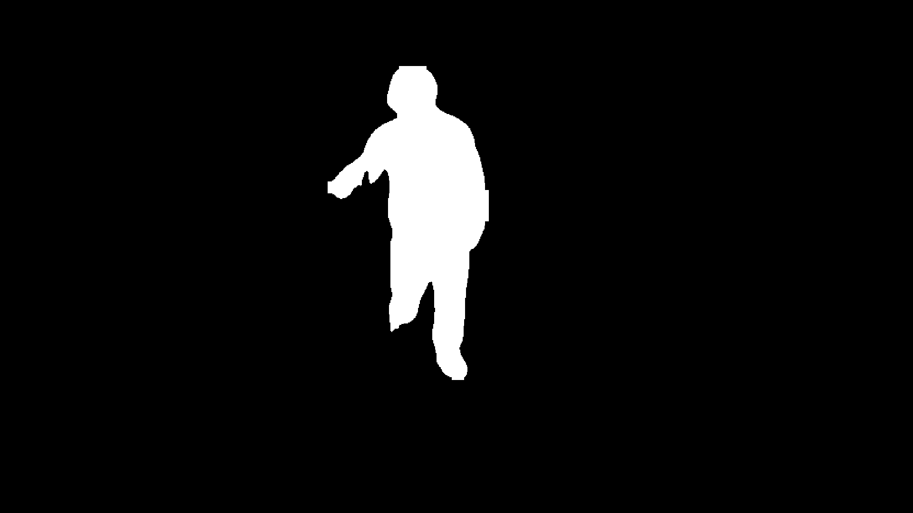
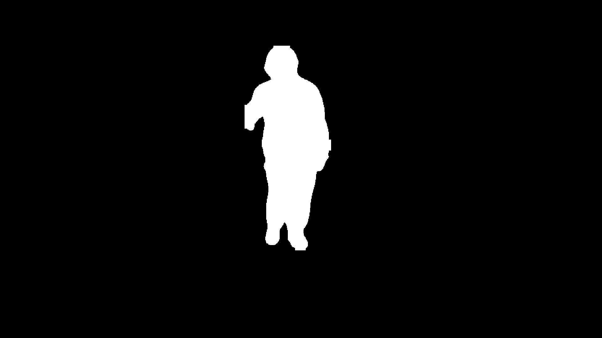
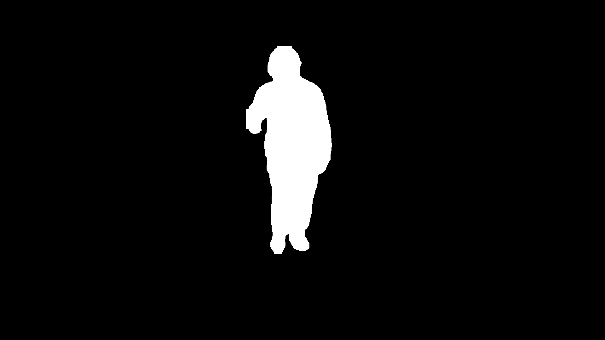
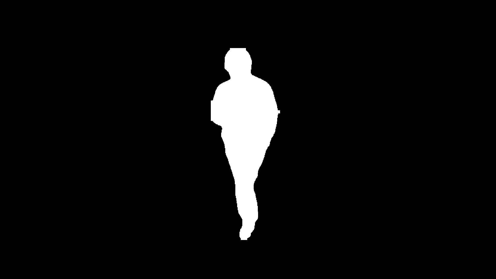
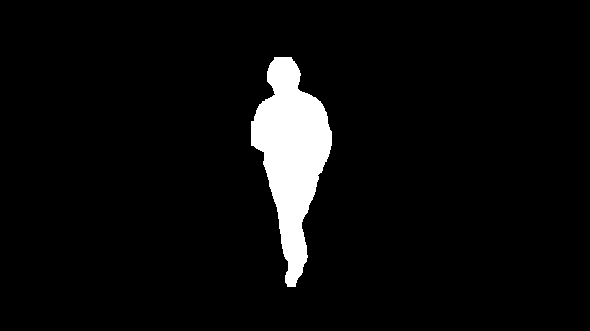

# Industrial-Gait Dataset

This repository provides the processed Industrial-Gait dataset collected in a real-world access-control environment.

The released dataset contains human silhouette sequences and corresponding human keypoint annotations from two walking directions: `000°` and `180°`.

Original RGB images are not included.

## Dataset Contents

The released data include:

* Human silhouette images in PNG format
* Corresponding human keypoint annotations in JSON format
* Walking sequences from the `000°` and `180°` directions
* Original directory and temporal sequence organization
* Complete processed silhouette and keypoint data

## Sample Silhouette Sequence

### View 000 — 60 Frames
<p align="left">
  <a href="000/frame_0000_src_0118.png"></a>
  <a href="000/frame_0001_src_0119.png"></a>
  <a href="000/frame_0002_src_0120.png"></a>
  <a href="000/frame_0003_src_0121.png"></a>
  <a href="000/frame_0004_src_0122.png"></a>
  <a href="000/frame_0005_src_0123.png"></a>
  <a href="000/frame_0006_src_0124.png"></a>
  <a href="000/frame_0007_src_0125.png"></a>
  <a href="000/frame_0008_src_0126.png"></a>
  <a href="000/frame_0009_src_0127.png"></a>
</p>

<p align="left">
  <a href="000/frame_0010_src_0128.png"></a>
  <a href="000/frame_0011_src_0129.png"></a>
  <a href="000/frame_0012_src_0130.png"></a>
  <a href="000/frame_0013_src_0131.png"></a>
  <a href="000/frame_0014_src_0132.png"></a>
  <a href="000/frame_0015_src_0133.png"></a>
  <a href="000/frame_0016_src_0134.png"></a>
  <a href="000/frame_0017_src_0135.png"></a>
  <a href="000/frame_0018_src_0136.png"></a>
  <a href="000/frame_0019_src_0137.png"></a>
</p>

<a href="000/frame_0020_src_0138.png"></a> <a href="000/frame_0021_src_0139.png"></a> <a href="000/frame_0022_src_0140.png"></a> <a href="000/frame_0023_src_0141.png"></a> <a href="000/frame_0024_src_0142.png"></a> <a href="000/frame_0025_src_0143.png"></a> <a href="000/frame_0026_src_0144.png"></a> <a href="000/frame_0027_src_0145.png"></a> <a href="000/frame_0028_src_0146.png"></a> <a href="000/frame_0029_src_0147.png"></a> <br>

<a href="000/frame_0030_src_0148.png"></a> <a href="000/frame_0031_src_0149.png"></a> <a href="000/frame_0032_src_0150.png"></a> <a href="000/frame_0033_src_0151.png"></a> <a href="000/frame_0034_src_0152.png"></a> <a href="000/frame_0035_src_0153.png"></a> <a href="000/frame_0036_src_0154.png"></a> <a href="000/frame_0037_src_0155.png"></a> <a href="000/frame_0038_src_0156.png"></a> <a href="000/frame_0039_src_0157.png"></a> <br>

<a href="000/frame_0040_src_0158.png"></a> <a href="000/frame_0041_src_0159.png"></a> <a href="000/frame_0042_src_0160.png"></a> <a href="000/frame_0043_src_0161.png"></a> <a href="000/frame_0044_src_0162.png"></a> <a href="000/frame_0045_src_0163.png"></a> <a href="000/frame_0046_src_0164.png"></a> <a href="000/frame_0047_src_0165.png"></a> <a href="000/frame_0048_src_0166.png"></a> <a href="000/frame_0049_src_0167.png"></a> <br>

<a href="000/frame_0050_src_0168.png"></a> <a href="000/frame_0051_src_0169.png"></a> <a href="000/frame_0052_src_0170.png"></a> <a href="000/frame_0053_src_0171.png"></a> <a href="000/frame_0054_src_0172.png"></a> <a href="000/frame_0055_src_0173.png"></a> <a href="000/frame_0056_src_0174.png"></a> <a href="000/frame_0057_src_0175.png"></a> <a href="000/frame_0058_src_0176.png"></a> <a href="000/frame_0059_src_0177.png"></a>

</p>

<p align="center">
  <em>Sixty consecutive silhouette frames from the 000° view. Click any image to view it at full resolution.</em>
</p>


## Directory Structure

The PNG silhouette images and JSON keypoint annotations are stored directly in the corresponding view folders.

```text
Industrial-Gait/
├── README.md
├── 000/
│   ├── frame_0000_src_0118.png
│   ├── frame_0000_src_0118.json
│   ├── frame_0001_src_0119.png
│   ├── frame_0001_src_0119.json
│   ├── frame_0002_src_0120.png
│   ├── frame_0002_src_0120.json
│   └── ...
└── 180/
    ├── frame_0000_src_0041.png
    ├── frame_0000_src_0041.json
    ├── frame_0001_src_0042.png
    ├── frame_0001_src_0042.json
    ├── frame_0002_src_0043.png
    ├── frame_0002_src_0043.json
    └── ...
```

PNG and JSON files with the same frame identifier correspond to the same frame.

For example:

```text
000/frame_0000_src_0118.png
000/frame_0000_src_0118.json
```

and:

```text
180/frame_0000_src_0041.png
180/frame_0000_src_0041.json
```

## File Formats

### Silhouette Images

Human silhouette sequences are stored as PNG images.

Each PNG file represents the segmented human body in one frame.

### Keypoint Annotations

Human keypoint annotations are stored as JSON files.

Each JSON file contains the detected human pose information corresponding to the PNG image with the same frame identifier.

## Download

The complete processed silhouette and keypoint dataset is available from the repository's [Releases](https://github.com/baijq233/Industrial-Gait/releases) page.

Download the dataset archive from the **Assets** section of the latest release.

After downloading, extract the archive using:

```bash
unzip <dataset-archive-name>.zip
```

The archive contains silhouette PNG images and keypoint JSON annotations. Original RGB images are not included.

## Research Applications

The dataset may be used for research involving:

* Gait recognition
* Silhouette-based gait recognition
* Skeleton-based gait recognition
* Cross-view gait recognition
* Occlusion-robust gait analysis
* Human pose and gait analysis in access-control environments

## Citation

When using this dataset in academic research, please cite the associated paper or this repository.

Detailed citation information will be added after the associated paper is published.

## Usage

The dataset is provided for academic research and reproducibility purposes.

Please refer to the repository and associated paper for further information about the dataset collection, organization, and evaluation protocols.

## Contact

For questions about the dataset or its usage, please open an issue in this repository.
